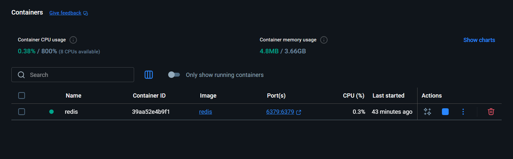
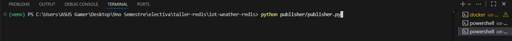
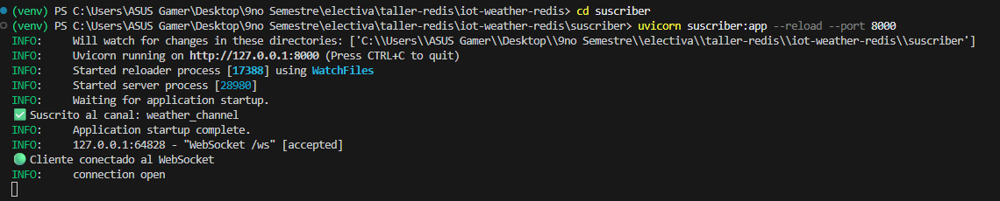
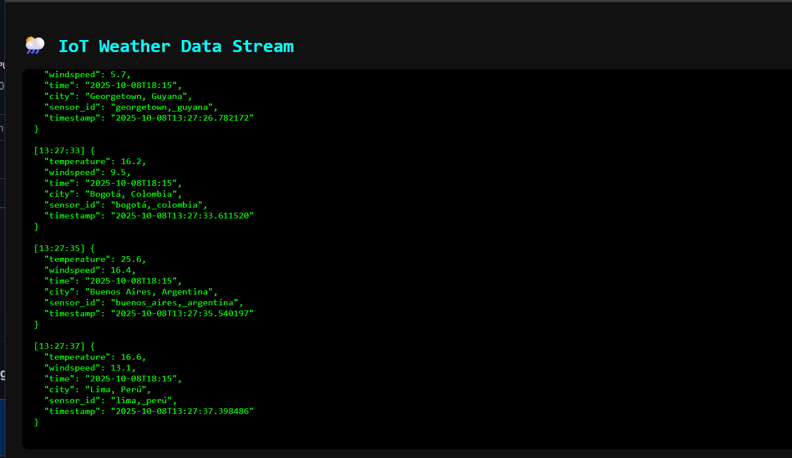

# 🌦️ IoT Weather Dashboard con Redis

Este proyecto simula un sistema **IoT distribuido** que recopila datos de clima desde diferentes ubicaciones geográficas, utilizando **Redis** como base de datos en memoria para el intercambio de mensajes en tiempo real.

El flujo completo es el siguiente:

```
Publisher (API clima) → Redis → Subscriber (FastAPI + WebSocket) → Frontend (HTML/JS)
```

---

## 🧠 Objetivo

* Implementar un sistema IoT en vivo con datos climáticos.
* Utilizar **Redis** para la comunicación entre procesos.
* Mostrar los datos en tiempo real en un cliente web.
* Fomentar el trabajo en equipo y la comprensión de sistemas distribuidos.

---

## 🧩 Estructura del Proyecto

```
iot-weather-redis/
│
├── publisher/
│   └── publisher.py
│
├── suscriber/
│   └── suscriber.py
│
├── web/
│   ├── index.html
│   └── app.js
│
├──  package.json
├──  README.md
└──  requirements.txt

```

---

## ⚙️ Requisitos previos

Antes de ejecutar el proyecto asegúrate de tener instalado:

* [Python 3.10+](https://www.python.org/downloads/)
* [Docker Desktop](https://www.docker.com/products/docker-desktop/)
* [Visual Studio Code](https://code.visualstudio.com/)
* Extensión **Live Server** (para el Frontend)
* Dependencias de Python:

  ```bash
  pip install fastapi "uvicorn[standard]" redis requests
  ```

---

## 🐳 1. Levantar Redis con Docker

Ejecuta en una terminal:

```bash
docker run --name redis -p 6379:6379 -d redis
```

Verifica que está corriendo:

```bash
docker ps
```


```



---

## 📡 2. Ejecutar el Publisher

En una nueva terminal (con tu entorno virtual activado):

```bash
cd publisher
python publisher.py
```


Esto comenzará a consultar la API de Open-Meteo y publicar los datos en el canal `weather_channel` dentro de Redis.


## 🌐 3. Ejecutar el Subscriber (Backend WebSocket)

En otra terminal:

```bash
cd suscriber
uvicorn suscriber:app --reload --port 8000
```

Esto levanta un servidor **FastAPI** en `http://127.0.0.1:8000` que escucha los datos de Redis y los retransmite a los navegadores conectados por WebSocket.



---

## 💻 4. Visualizar los datos (Frontend)

1. Abre la carpeta `web/` en **VS Code**.
2. Haz clic derecho sobre `index.html` → **"Open with Live Server"**.
3. Se abrirá el navegador en `http://127.0.0.1:5500` o similar.


```
[18:05:22] {
  "temperature": 19.2,
  "windspeed": 5.0,
  "city": "Asunción, Paraguay"
}
```



---

## 🧩 5. Flujo completo del sistema

1. **Publisher** → consulta la API y envía datos a Redis.
2. **Redis** → almacena y retransmite los mensajes.
3. **Subscriber** → escucha Redis y reenvía por WebSocket.
4. **Frontend (Live Server)** → recibe los datos y los muestra en tiempo real.

📸 **Captura 5:** *Diagrama o esquema del flujo general del sistema.*

---

## 🧹 6. Detener los servicios

Para cerrar todo correctamente:

```bash
# Detener el backend
CTRL + C

# Detener el Publisher
CTRL + C

# Detener Redis
docker stop redis
```

---
